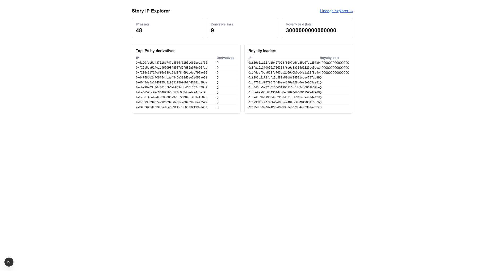
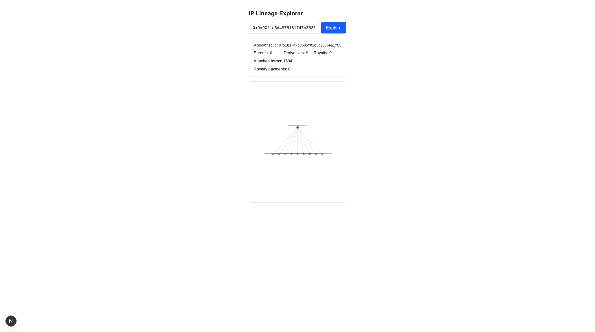

# story-ip-explorer

A [Next.js](https://nextjs.org) dashboard over the [`story-subgraph`](https://github.com/alexeymoskalev-devops/story-subgraph) GraphQL API: ecosystem metrics plus an interactive IP **lineage explorer** (parent→derivative graph rendered with [Cytoscape](https://js.cytoscape.org/)).

It fulfils the "IP Graph Explorer" idea and complements [`story-ip-graph-mcp`](https://github.com/alexeymoskalev-devops/story-ip-graph-mcp): the MCP server gives agents point-by-point on-chain reads, while this dashboard gives humans the aggregate metrics and the visual lineage view.

## Two views

### Overview (`/`)

Metric cards plus leaderboard tables:

- **IP assets**, **derivative links**, and **total royalty paid** metric cards. The first two are entity counts capped at 1000 and shown as `1000+` when the cap is hit (the subgraph is queried with `first: 1000`).
- **Top IPs by derivatives** and **Royalty leaders** tables.

### Explorer (`/explorer`)

- Enter an `ipId` (a `0x…` 40-hex-char address).
- See the **parent → derivative graph** for that IP, plus a **detail panel** with attached license terms and recent royalty payments.

## Prerequisites

A running `story-subgraph` GraphQL endpoint. Either:

- **Local graph-node** — see the [`../story-subgraph`](https://github.com/alexeymoskalev-devops/story-subgraph) README: `docker compose up -d`, then `graph create` / `graph deploy`, synced to chain head. The endpoint is then `http://localhost:8000/subgraphs/name/story-subgraph`.
- **Hosted deployment** — point at any deployed `story-subgraph` GraphQL URL.

## Setup

1. Install dependencies:

   ```bash
   npm install
   ```

2. Configure the subgraph endpoint:

   ```bash
   cp .env.example .env.local
   ```

   Set `NEXT_PUBLIC_SUBGRAPH_URL` in `.env.local`. For a local graph-node:

   ```
   NEXT_PUBLIC_SUBGRAPH_URL=http://localhost:8000/subgraphs/name/story-subgraph
   ```

3. Run the dev server:

   ```bash
   npm run dev
   ```

   Then open:
   - http://localhost:3000 — Overview
   - http://localhost:3000/explorer — Explorer

## Testing

Unit tests cover the `validate` and `transform` pure functions:

```bash
npm test        # vitest run
```

Compile / production build:

```bash
npm run build
```

### Live smoke test

`scripts/smoke.mjs` is a no-browser, end-to-end check. It runs the explorer's actual `IP_LINEAGE` query against `NEXT_PUBLIC_SUBGRAPH_URL` and prints a known IP's lineage (parents, derivatives, attached terms, royalty payments):

```bash
NEXT_PUBLIC_SUBGRAPH_URL=http://localhost:8000/subgraphs/name/story-subgraph \
  node scripts/smoke.mjs
```

Override the target IP with `SMOKE_IP=0x…`. This confirms the explorer query path works against a live subgraph without spinning up a browser.

## Deploy

Deploy on [Vercel](https://vercel.com/new). Set the `NEXT_PUBLIC_SUBGRAPH_URL` environment variable in the project settings to your subgraph endpoint.

## Why not Dune?

Story is not in Dune's chain catalog, so on-chain analytics cannot be served from Dune SQL. Instead, this dashboard reads from our own `story-subgraph` deployment.

## Follow-up

Time-series metrics (growth-over-time) need a `DailySnapshot` entity in `story-subgraph`. The underlying events are indexed, but they are not yet daily-aggregated, so v1 shows current-state snapshots only. Adding daily aggregation in the subgraph is the documented next step.

## Demo

Live against a local `story-subgraph` indexing aeneid.

**Overview** — ecosystem metrics + leaderboards:



**Lineage explorer** — parent `0x9a90f1c5…1f65` with its on-chain derivatives (license terms `1894`):



## Part of a 4-repo Story Protocol contribution

Built for the Story "AI × IP" direction, in two independent tracks:

**Track A — agents**
- [story-ip-graph-mcp](https://github.com/alexeymoskalev-devops/story-ip-graph-mcp) — MCP server: derivative/remix registration + IP-graph lineage reads
- [story-ip-agent-demo](https://github.com/alexeymoskalev-devops/story-ip-agent-demo) — autonomous ElizaOS agent that drives the MCP server

**Track B — data**
- [story-subgraph](https://github.com/alexeymoskalev-devops/story-subgraph) — open-source The Graph subgraph indexing live Story Protocol
- **story-ip-explorer** — Next.js dashboard + lineage explorer over the subgraph — *this repo*

## License

MIT
